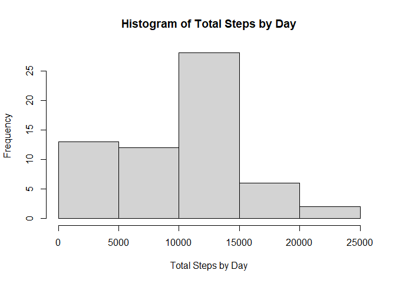
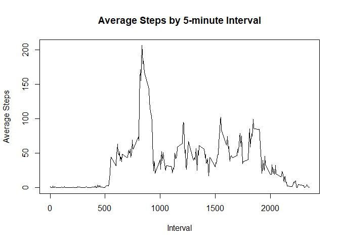
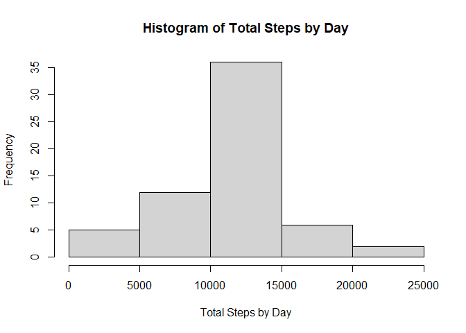
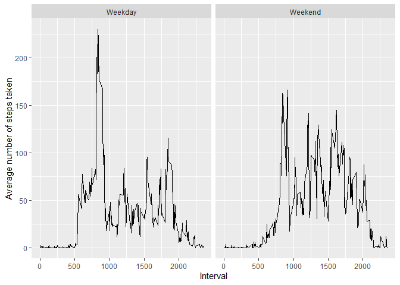

# Course Project 1

## Read in the data


```r
library(dplyr)
```

```
## 
## Attaching package: 'dplyr'
```

```
## The following objects are masked from 'package:stats':
## 
##     filter, lag
```

```
## The following objects are masked from 'package:base':
## 
##     intersect, setdiff, setequal, union
```

```r
library(ggplot2)
step_data<-read.csv("activity.csv")
```
## What is the mean total number of steps taken per day

Histogram of total number of steps taken each day


```r
grouped_data<-step_data%>%group_by(date)%>%summarise(tot_steps=sum(steps,na.rm=TRUE))
hist(grouped_data$tot_steps,xlab="Total Steps by Day",main="Histogram of Total Steps by Day")
```

<!-- -->

```r
mean_steps<-format(mean(grouped_data$tot_steps),scientific=FALSE)
median_steps<-format(median(grouped_data$tot_steps),sceintific=FALSE)
```

The mean total number of steps per day is 9354.23. The median number of steps per day is 10395.  

## What is the average daily pattern?

Time series plot of the 5-minute intervals and the average number of total steps taken


```r
grouped_data<-step_data%>%group_by(interval)%>%summarise(avg_steps=mean(steps,na.rm=TRUE))
plot(grouped_data$interval,grouped_data$avg_steps,type="l",xlab="Interval",ylab="Average Steps",main="Average Steps by 5-minute Interval")
```

<!-- -->

```r
max_interval<-grouped_data[which.max(grouped_data$avg_steps),1]
```
The 5-minute interval with the maximum average number of steps is interval 835.

## Imputing missing values


```r
num_NA<-sum(is.na(step_data$steps))
```

There are 2304 missing values in the dataset.

We will impute the missing values using the mean of the interval of the missing value. Here is a histogram of the dataset with imputed values.


```r
imputed_data<-step_data%>%group_by(interval)%>%mutate(steps=ifelse(is.na(steps),mean(steps,na.rm=TRUE),steps))
grouped_imputed_data<-imputed_data%>%group_by(date)%>%summarise(tot_steps=sum(steps))
hist(grouped_imputed_data$tot_steps,xlab="Total Steps by Day",main="Histogram of Total Steps by Day")
```

<!-- -->

```r
mean_imputed_steps<-format(mean(grouped_imputed_data$tot_steps),scientific=FALSE)
median_imputed_steps<-format(median(grouped_imputed_data$tot_steps),scientific=FALSE)
```

After imputing the missing values, the mean total number of steps per day is 10766.19, and the median number of steps per day is 10766.19.

The impact of imputing values brings the mean and median number of steps per day up. 

## Are there differences in activity patterns between weekdays and weekends?


```r
imputed_data$date<-as.Date(imputed_data$date)
weekday_data<-imputed_data%>%mutate(wkdy=ifelse(weekdays(date)=="Sunday"|weekdays(date)=="Saturday","Weekend","Weekday"))
#imputed_weekday_data<-weekday_data%>%group_by(interval)%>%mutate(steps=ifelse(is.na(steps),mean(steps,na.rm=TRUE),steps))
grouped_imputed_weekday_data<-weekday_data%>%group_by(interval,wkdy)%>%summarise(avg_steps=mean(steps,na.rm=TRUE))
```

```
## `summarise()` has grouped output by 'interval'. You can override using the `.groups` argument.
```

```r
qplot(interval,avg_steps,data=grouped_imputed_weekday_data,facets=.~wkdy,geom="line",xlab="Interval",ylab="Average number of steps taken")
```

<!-- -->
